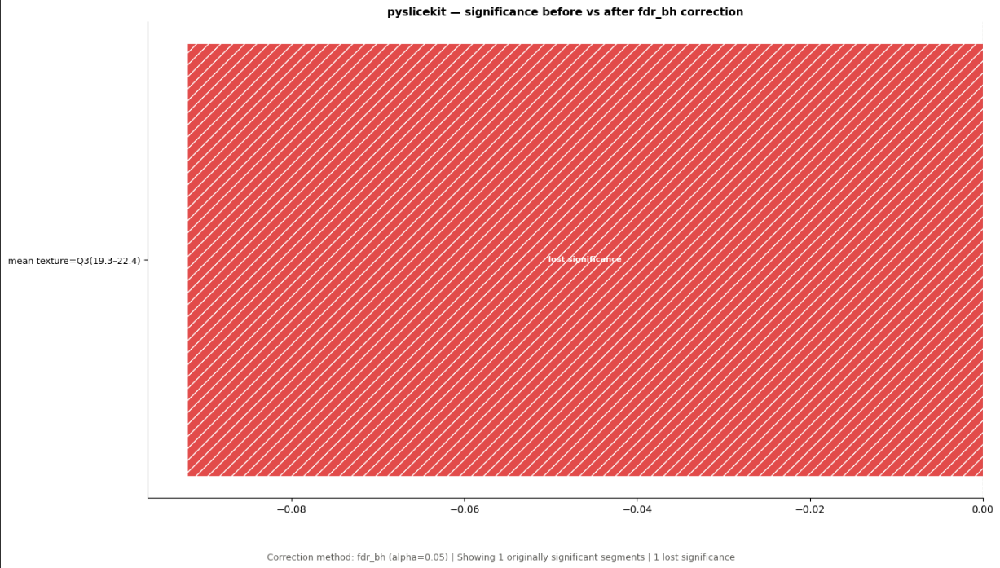
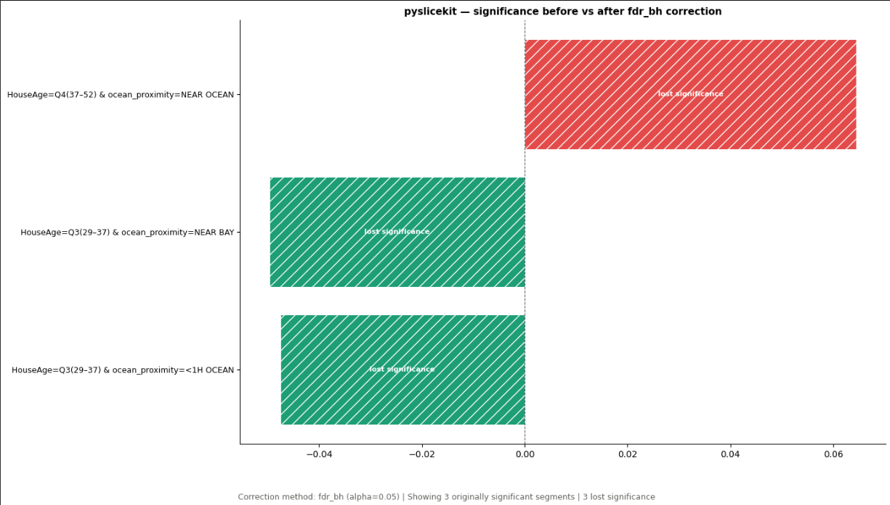

# PySliceKit

[](https://pypi.org/project/pyslicekit/)
[](https://github.com/AnshumanTiwari2006/PySliceKit/blob/main/LICENSE)
[](https://github.com/AnshumanTiwari2006/PySliceKit)

**PySliceKit** is a Python library for automatically discovering where machine learning models underperform across different data subgroups.

Global metrics such as 95% accuracy or a low RMSE can be misleading. A model may perform well overall while performing poorly on specific age groups, geographic regions, or combinations of features.

PySliceKit automatically slices your dataset, evaluates model performance across subgroups, measures statistical significance, and helps identify your model's most important blind spots.

---

## Project Links

| Resource | Link |
|---|---|
| Documentation | [Read the Documentation](https://AnshumanTiwari2006.github.io/PySliceKit/) |
| Homepage | [PySliceKit Homepage](https://AnshumanTiwari2006.github.io/PySliceKit/) |
| Repository | [GitHub Repository](https://github.com/AnshumanTiwari2006/PySliceKit) |
| Changelog | [View Changelog](https://github.com/AnshumanTiwari2006/PySliceKit/blob/main/CHANGELOG.md) |
| Discussions | [Discussion Board](https://github.com/AnshumanTiwari2006/PySliceKit/discussions) |
| Issues | [Report an Issue](https://github.com/AnshumanTiwari2006/PySliceKit/issues) |
| PyPI | [PySliceKit on PyPI](https://pypi.org/project/pyslicekit/) |
| Research Paper | [Read the Research Paper](https://github.com/AnshumanTiwari2006/PySliceKit/blob/main/Pyslicekit_Research_Paper.pdf) |

---

## Documentation

Explore the complete [PySliceKit Documentation](https://AnshumanTiwari2006.github.io/PySliceKit/) for:

- Getting Started guide
- User Guide
- API Reference
- Statistical correction guide
- Multiple-comparisons analysis

---

## Quick Start

### Installation

```bash
pip install pyslicekit
```

### Basic Usage

```python
from sklearn.datasets import load_breast_cancer
from sklearn.linear_model import LogisticRegression
from sklearn.model_selection import train_test_split
import pyslicekit

# 1. Load the dataset
data = load_breast_cancer(as_frame=True)
df = data.frame

X = df.drop(columns=["target"])
y = df["target"]

# 2. Train the model
X_train, X_test, y_train, y_test = train_test_split(
    X,
    y,
    test_size=0.25,
    random_state=42
)

model = LogisticRegression(max_iter=5000)
model.fit(X_train, y_train)

# 3. Discover subgroup performance gaps
results = pyslicekit.evaluate(
    model=model,
    df=X_test,
    y_true=y_test,
    y_pred=model.predict(X_test),
    slice_cols=["mean radius", "mean texture"],
    metric="f1"
)
```

### What does this do?

When you call `pyslicekit.evaluate()`, PySliceKit automatically divides your test dataset into subgroups, evaluates model performance within each subgroup, and applies suitable statistical tests to identify potentially meaningful performance differences.

---

## Visualizing Model Blind Spots

PySliceKit library generates visual reports that help you understand subgroup performance.

### Heatmap

The heatmap displays performance gaps across different subgroups. Larger negative gaps indicate subgroups where the model performs worse than its overall baseline.

### Worst Segments

The worst-segments visualization highlights the subgroups with the largest performance drops, helping you identify areas that may require further investigation.

---

## Statistical Corrections — v2.0.1

Version **2.0.1** introduces statistical improvements for handling multiple subgroup hypotheses.

### Multiple-Comparisons Correction

PySliceKit now supports analysis using:

- **Bonferroni correction** to control the family-wise error rate.
- **Benjamini–Hochberg correction** to control the false discovery rate.
- Corrected significance decisions and reporting.
- Independent verification of correction calculations.

### Bootstrap Significance Improvements

Version 2.0.1 also includes:

- A fix for an error in the bootstrap p-value calculation.
- A two-tailed bootstrap p-value calculation.
- Analysis of the finite resolution of bootstrap-based p-values.
- Investigation of how the number of bootstrap resamples affects statistical correction.

Read the complete [Correction Guide](https://AnshumanTiwari2006.github.io/PySliceKit/correction_guide.html).

### Correction Analysis Visualizations

#### Breast Cancer Dataset



#### California Housing Dataset



---

## Features

- **Model Agnostic:** Works with models that provide a `.predict()` method.
- **Automatic Subgroup Discovery:** Evaluates individual features and feature combinations.
- **Statistical Testing:** Supports Z-tests, Fisher's Exact Test, and bootstrap-based analysis.
- **Multiple-Comparisons Analysis:** Supports Bonferroni and Benjamini–Hochberg correction.
- **Correction Reporting:** Helps compare uncorrected and corrected significance results.
- **Visual Reports:** Generates charts for identifying underperforming subgroups.
- **Export Support:** Export findings for further analysis and auditing.
- **Documentation:** Includes a Sphinx-based documentation website and statistical guides.

---

## Research

PySliceKit's statistical correction work was evaluated across four public datasets covering both classification and regression tasks.

The research examined:

- The effect of multiple-comparisons correction on subgroup findings.
- Differences between classification and bootstrap-based regression tests.
- Bootstrap p-value resolution limits.
- Independent verification of statistical correction calculations.

To be updated.

---

## Changelog

See the complete [CHANGELOG.md](https://github.com/AnshumanTiwari2006/PySliceKit/blob/main/CHANGELOG.md) for version history and release details.

------------------

## License

PySliceKit is licensed under the [MIT License](https://github.com/AnshumanTiwari2006/PySliceKit/blob/main/LICENSE).
