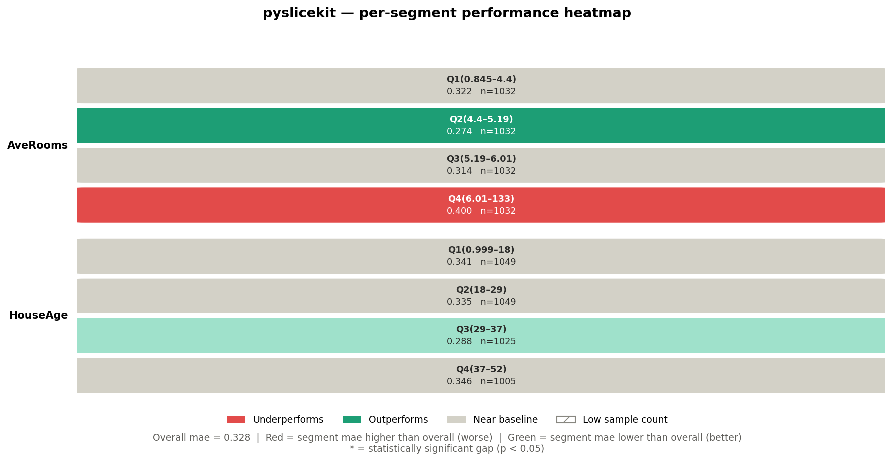
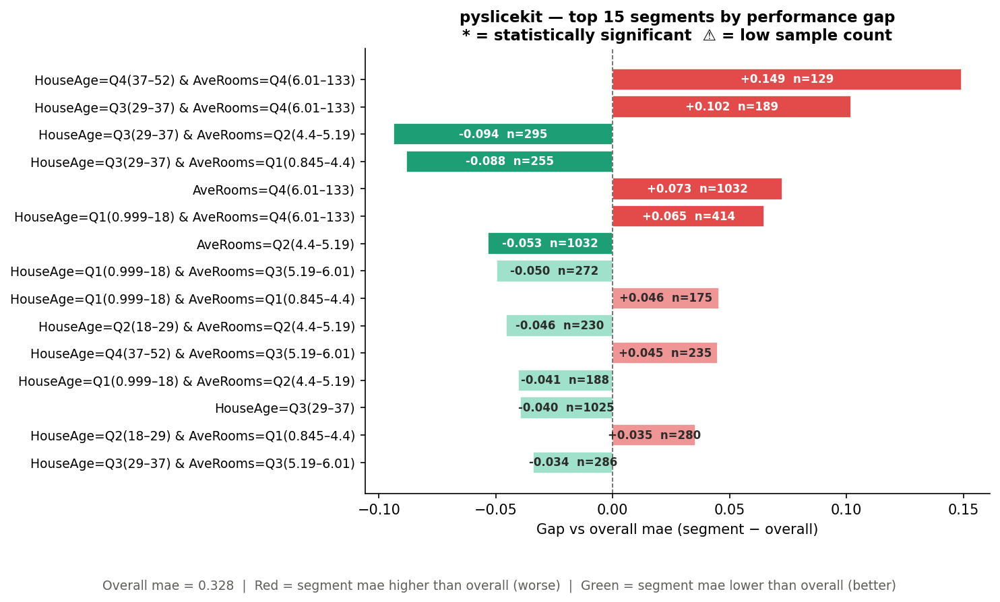
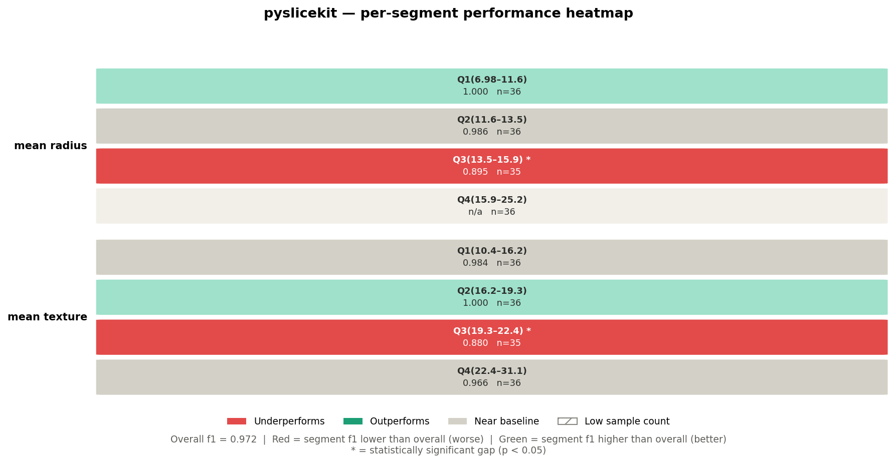
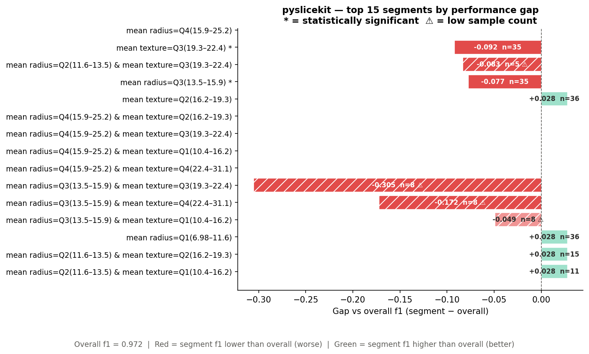

User Guide
==========

This guide teaches you everything you need to use PySliceKit confidently —
from the core idea, through two complete walkthroughs, to the statistical
machinery running under the hood. Read it once and you will never misread
a result again.

----

The Problem with Global Metrics
--------------------------------

Imagine you deploy a pricing model for real estate, and it boasts an overall
Mean Absolute Error (MAE) of $40,000. On paper, it sounds robust. But when
you dig into the data, you discover that for houses older than 50 years near
the ocean, the MAE balloons to $120,000.

Relying purely on "global" metrics masks critical algorithmic bias, data drift,
and localized underfitting. Finding these edge cases manually by writing endless
Pandas ``groupby()`` statements is tedious, non-scalable, and statistically
dangerous — you might mistake random noise in a small sample for a real problem,
or miss a real problem because you never thought to look there.

The PySliceKit Solution
-----------------------

**PySliceKit** acts as an automated detective for your models. Instead of you
manually guessing where your model might fail, PySliceKit does five things
automatically:

1. **Bins numeric columns:** Converts continuous columns like Age or Income
   into human-readable quartile labels (``Q1(18–34)``, ``Q2(34–52)``, …)
   so you never have to write ``pd.cut()`` yourself.

2. **Cross-products features:** Combines columns together up to a configurable
   depth — so ``Age`` and ``Geography`` become ``Age=Q1 & Geography=North``,
   ``Age=Q1 & Geography=South``, and so on.

3. **Applies statistical rigor:** Runs the right hypothesis test automatically
   — Z-Test, Fisher's Exact, or Bootstrap CI — to ensure a drop in performance
   is a mathematically real failure, not just noise from a small sample.

4. **Flags low-sample segments:** Any segment below ``min_samples`` is still
   shown, but is visually hatched so you know to treat it with caution.

5. **Enforces a visual contract:** In every chart PySliceKit produces,
   **Red always means bad** — regardless of whether your metric is Accuracy
   (higher is better) or MAE (lower is better). You never have to remember
   which direction the metric goes.

----

How PySliceKit Processes Your Data
------------------------------------

Understanding what happens inside ``pyslicekit.evaluate()`` makes results much easier
to interpret. Here is the exact sequence of steps:

**Step 1 — Validation.**
PySliceKit checks every input before doing any work. If ``y_true`` and
``y_pred`` have different lengths, if a ``slice_col`` does not exist in your
DataFrame, or if the metric string is not supported, you get a specific
``PySliceKitValidationError`` that names the exact problem.

**Step 2 — Column pre-processing.**
Each column in ``slice_cols`` is inspected. Numeric columns (integer or float
dtype) are automatically binned into quartiles using ``pd.qcut``. Categorical
or string columns are used as-is. Columns with more than 20 unique values
trigger a ``UserWarning`` — they will still be processed, but they will produce
many segments. You may want to group them first.

**Step 3 — Segment construction.**
PySliceKit generates every combination of column values up to ``depth``
levels deep. At ``depth=1``, each unique value in each column becomes a
segment. At ``depth=2``, every pair of values across columns is also a
segment. The total number of segments grows quickly, so ``depth`` is capped
at 2 in the current version.

**Step 4 — Metric and gap computation.**
For each segment, PySliceKit computes your chosen metric (e.g. MAE, accuracy,
F1) on only the rows in that segment. It then subtracts the overall dataset
metric to produce a signed **gap**:

.. code-block:: text

    gap = segment_metric − overall_metric

A gap of ``+0.149`` on MAE means this segment's error is 0.149 units *higher*
than the baseline — which is bad, because lower MAE is better. A gap of
``-0.092`` on F1 means this segment's F1 is 0.092 points *lower* than the
baseline — which is also bad, because higher F1 is better. PySliceKit
understands this distinction automatically.

**Step 5 — Statistical significance testing.**
Each gap is tested to determine whether it is a genuine structural failure or
just random noise. The test chosen depends on the task type and sample size.
This is explained in full in the section below.

**Step 6 — Sorting and rendering.**
Results are sorted by absolute gap, worst first. The renderer then produces
two figures: a heatmap (single-column slices only) and a ranked bar chart
(all slices). Both figures are returned, and optionally saved to disk.

----

Understanding the Gap Sign
---------------------------

This is the single most common source of confusion. The gap is always
``segment_metric − overall_metric``, but what "bad" means depends on the
metric direction:

.. list-table::
   :header-rows: 1
   :widths: 20 20 30 30

   * - Metric
     - Direction
     - Positive gap means…
     - Negative gap means…
   * - ``accuracy``
     - Higher is better
     - Segment **outperforms** (green)
     - Segment **underperforms** (red)
   * - ``f1``, ``f1_macro``, ``f1_weighted``
     - Higher is better
     - Segment **outperforms** (green)
     - Segment **underperforms** (red)
   * - ``precision``, ``recall``
     - Higher is better
     - Segment **outperforms** (green)
     - Segment **underperforms** (red)
   * - ``r2``
     - Higher is better
     - Segment **outperforms** (green)
     - Segment **underperforms** (red)
   * - ``mae``, ``rmse``, ``mse``
     - **Lower is better**
     - Segment **underperforms** (red)
     - Segment **outperforms** (green)

PySliceKit stores the direction for every metric in an internal registry
(``METRIC_REGISTRY`` in ``types.py``). The renderer reads this registry
so the colour scale is always correct — you never need to configure it.

----

How PySliceKit Decides if a Gap is Real
-----------------------------------------

A gap is just a number. Before you act on it, you need to know whether it
reflects a genuine structural weakness in your model, or whether it could
have appeared by chance because the segment is small.

PySliceKit runs a hypothesis test on every segment automatically. The test
chosen depends on two factors: the task type (classification vs regression)
and the segment size. Here is the complete decision tree:

.. code-block:: text

    Is the metric value NaN?
    └── Yes → Cannot test. No marker shown.
    Is n < min_samples?
    └── Yes → Marked ⚠ (low-n). Test is skipped as unreliable.
    Is the task regression (mae, rmse, mse, r2)?
    └── Yes → Bootstrap Confidence Interval (1,000 resamples)
    Is n >= 30?
    └── Yes → Two-Proportion Z-Test
    Is n < 30?
    └── Yes → Fisher's Exact Test

A segment marked with ``*`` passed its test at p < 0.05. A segment with no
``*`` either did not pass, or the test was skipped.

Test 1 — Two-Proportion Z-Test (classification, n ≥ 30)
~~~~~~~~~~~~~~~~~~~~~~~~~~~~~~~~~~~~~~~~~~~~~~~~~~~~~~~~~

When you have 30 or more samples in a segment and you are running a
classification task, PySliceKit runs a **two-proportion z-test**.

The intuition: it treats every row as a binary outcome — "did the model get
this right?" It then asks: *"Is the proportion of correct predictions in
this segment statistically different from the overall proportion?"*

The formula for the z-statistic is:

.. code-block:: text

    z = (p_segment − p_overall) / sqrt(p_overall × (1 − p_overall) / n)

where ``p_segment`` is the fraction of correct predictions in the segment,
``p_overall`` is the fraction correct on the full test set, and ``n`` is the
segment size. A two-tailed p-value is computed from the standard normal
distribution. If p < 0.05, the segment is marked ``*``.

The z-test is fast, analytically exact for large n, and the right default
for any segment with 30 or more samples. Below 30, its normal approximation
starts to break down — which is why PySliceKit switches to Fisher's Exact
for small segments.

Test 2 — Fisher's Exact Test (classification, n < 30)
~~~~~~~~~~~~~~~~~~~~~~~~~~~~~~~~~~~~~~~~~~~~~~~~~~~~~~~

When a classification segment has fewer than 30 samples, PySliceKit
automatically switches to **Fisher's Exact Test**.

Fisher's Exact makes no distributional assumptions. It works directly with
counts in a 2×2 contingency table and is valid even for very small samples:

.. code-block:: text

    ┌──────────────────┬─────────┬───────────┐
    │                  │ Correct │ Incorrect │
    ├──────────────────┼─────────┼───────────┤
    │ Segment (actual) │    a    │     b     │
    │ Expected at p₀   │    c    │     d     │
    └──────────────────┴─────────┴───────────┘

where ``c`` and ``d`` are derived from the overall accuracy × n. The exact
probability of this table (or a more extreme one) is computed directly.

The trade-off: Fisher's is more reliable than the z-test at small n, but even
Fisher's has limited power when n is below about 10. This is why segments
below ``min_samples`` are flagged ⚠ regardless of which test is used — the
result is included so you can see it, but you should collect more data before
acting on it.

Test 3 — Bootstrap Confidence Interval (regression)
~~~~~~~~~~~~~~~~~~~~~~~~~~~~~~~~~~~~~~~~~~~~~~~~~~~~~

For regression metrics (MAE, RMSE, MSE, R²), there is no clean "proportion
correct" framing, so z-tests and Fisher's Exact do not apply. PySliceKit
instead uses a **bootstrap confidence interval**.

The procedure:

1. Resample the segment's rows 1,000 times with replacement.
2. Compute the chosen metric on each resample.
3. Build a 95% confidence interval from the 2.5th and 97.5th percentiles
   of those 1,000 values.
4. If the overall dataset metric falls *outside* that interval, the gap is
   statistically significant (marked ``*``).

A pseudo p-value is also computed: the fraction of bootstrap samples where
the metric was at least as extreme as the overall metric. This is stored in
``SliceResult.p_value`` and is exported with ``pyslicekit.to_csv()`` and ``pyslicekit.to_json()``.

The bootstrap approach is distribution-free and works for any regression
metric. Its main cost is computational — 1,000 resamples per segment — but
this is acceptable for typical audit dataset sizes.

----

Reading the Charts
-------------------

PySliceKit always produces exactly two figures. Here is how to read each one.

The Heatmap
~~~~~~~~~~~

The heatmap shows **single-column slices only** (``depth=1`` results). Each
row in the heatmap corresponds to one of your ``slice_cols``. Each cell
within a row corresponds to one unique value (or quartile bin) of that column.

Looking at the California Housing heatmap above:

- **Row label** (left side): the column name — ``AveRooms``, ``HouseAge``.
- **Cell label** (top line in cell): the value or bin — ``Q4(6.01–133)``.
- **Metric value** (bottom line in cell): the MAE for that segment — ``0.400``.
- **n=**: the number of rows in that segment.
- **Cell colour**: red means the segment underperforms the baseline; green
  means it outperforms; grey means it is near the baseline (gap < 2%).
- **Hatching** (diagonal lines): the segment has fewer rows than
  ``min_samples`` — treat with caution.
- **Asterisk \*** after the value: the gap is statistically significant
  at p < 0.05.

Two-column cross-product segments (``depth=2``) do **not** appear in the
heatmap, because a pair of columns cannot be laid out cleanly on a 2D grid.
They appear in the bar chart instead.

The Bar Chart
~~~~~~~~~~~~~

The bar chart shows the **top N segments ranked by absolute gap**, across
all depths. It is sorted worst-first, so the most urgent problems are always
at the top.

Looking at the California Housing bar chart above:

- **Y-axis labels**: the full segment definition — e.g.
  ``HouseAge=Q4(37–52) & AveRooms=Q4(6.01–133)``. Two-column segments
  appear here even though they are absent from the heatmap.
- **Bar length**: the magnitude of the gap. Bars extending to the right are
  positive gaps; bars extending to the left are negative gaps.
- **Bar colour**: same rule as the heatmap — red is always bad, green is
  always good, regardless of metric direction.
- **Text inside the bar**: the gap value (e.g. ``+0.149``) and the sample
  size (e.g. ``n=129``).
- **⚠ after n=**: this segment is below ``min_samples``.
- **\* after the segment label**: the gap is statistically significant.
- **Dashed vertical line at 0**: the baseline. Everything to the right of
  this line has a positive gap; everything to the left has a negative gap.
  Whether positive or negative is "bad" depends on the metric — but the
  colour tells you immediately.

----

Walkthrough 1: Regression (California Housing)
-----------------------------------------------

Let's see how this works on a real dataset. We train a Random Forest on the
California Housing dataset and evaluate it with MAE.

.. code-block:: python

    import pandas as pd
    from sklearn.datasets import fetch_california_housing
    from sklearn.ensemble import RandomForestRegressor
    from sklearn.model_selection import train_test_split
    import pyslicekit

    # Load data
    cali = fetch_california_housing(as_frame=True)
    df = cali.frame
    X = df.drop(columns=['MedHouseVal'])
    y = df['MedHouseVal']

    X_train, X_test, y_train, y_test = train_test_split(
        X, y, test_size=0.2, random_state=42
    )

    # Train model
    model = RandomForestRegressor(n_estimators=100, random_state=42)
    model.fit(X_train, y_train)
    y_pred = model.predict(X_test)

    # Audit the model across HouseAge and AveRooms segments
    results = pyslicekit.evaluate(
        model=model,
        df=X_test,
        y_true=y_test,
        y_pred=y_pred,
        slice_cols=['HouseAge', 'AveRooms'],
        metric='mae',
        min_samples=50,
        depth=2
    )

    # Inspect the top 3 worst segments programmatically
    for r in results[:3]:
        print(r)

**Heatmap output:**

**Bar chart output:**

**What did the library just find?**

The overall MAE across the test set is **0.328**. Now look at the bar chart.

The worst segment is ``HouseAge=Q4(37–52) & AveRooms=Q4(6.01–133)`` with a
gap of ``+0.149`` and n=129. Because this is MAE (lower is better), a positive
gap means this segment's error is 0.149 units *higher* than the baseline —
so the model's actual MAE on these old, large-roomed houses is
0.328 + 0.149 = **0.477**. That is 45% worse than the overall figure.
The absence of a ``*`` here means the gap did not reach statistical
significance — possibly because n=129, while large, has high variance in
this particular segment. You would investigate further.

The fourth segment in the bar chart, ``HouseAge=Q3(29–37) & AveRooms=Q2(4.4–5.19)``,
has a gap of ``-0.094`` and n=295. Because this is MAE, a *negative* gap is
actually good — the model performs better than baseline on these houses.
The renderer colours it green automatically.

On the heatmap, the ``AveRooms=Q4(6.01–133)`` cell is red (MAE=0.400, which
is 0.072 above the 0.328 baseline), while ``AveRooms=Q2(4.4–5.19)`` is green
(MAE=0.274). This tells you that average room count is a meaningful slice
dimension — the model systematically struggles more on high-room properties.

**Exporting the results:**

.. code-block:: python

    import pyslicekit

    # Save for stakeholder review
    pyslicekit.to_csv(results, "california_housing_audit.csv")
    pyslicekit.to_json(results, "california_housing_audit.json")
    print("Exported to CSV and JSON successfully!")

----

Walkthrough 2: Classification (Breast Cancer)
----------------------------------------------

Now let's audit a Logistic Regression model on a binary classification task,
using F1 score as the metric.

.. code-block:: python

    from sklearn.datasets import load_breast_cancer
    from sklearn.linear_model import LogisticRegression
    from sklearn.model_selection import train_test_split
    import pyslicekit

    cancer = load_breast_cancer(as_frame=True)
    df_c = cancer.frame
    X_c = df_c.drop(columns=['target'])
    y_c = df_c['target']

    X_train_c, X_test_c, y_train_c, y_test_c = train_test_split(
        X_c, y_c, test_size=0.25, random_state=42
    )

    clf = LogisticRegression(max_iter=5000)
    clf.fit(X_train_c, y_train_c)
    y_pred_c = clf.predict(X_test_c)

    # Audit using F1 Score
    results_clf = pyslicekit.evaluate(
        model=clf,
        df=X_test_c,
        y_true=y_test_c,
        y_pred=y_pred_c,
        slice_cols=['mean radius', 'mean texture'],
        metric='f1',
        min_samples=10,
        depth=2
    )

**Heatmap output:**

**Bar chart output:**

**What did the library just find?**

The overall F1 across the test set is **0.972**. Now look at the heatmap.

The ``mean radius=Q3(13.5–15.9) *`` cell is deep red with F1=0.895 and n=35.
The ``*`` tells you this gap is statistically significant — a two-proportion
z-test (n=35 ≥ 30) confirmed that the drop from 0.972 to 0.895 is not random
noise. This is a genuine blind spot in the model for mid-range tumour radii.

Notice that ``mean radius=Q4(15.9–25.2)`` shows ``n/a`` with a light grey
background. This means F1 could not be computed for that segment — likely
because the segment contained only one class in the test split, making binary
F1 undefined. PySliceKit surfaces this as ``NaN`` rather than crashing, and
the renderer fills the cell with a "no data" colour.

On the bar chart, the heavily hatched bars (diagonal lines) are segments below
``min_samples=10``. The worst of these — ``mean radius=Q3 & mean texture=Q3``
with gap ``-0.305`` and n=8 — looks alarming, but the hatching and ⚠ marker
tell you this result is based on only 8 samples. Do not act on it without
more data. The ``*`` segments without hatching (like ``mean texture=Q3(19.3–22.4) *``
with n=35) are the ones worth investigating immediately.

----

Working with SliceResult Objects
----------------------------------

``pyslicekit.evaluate()`` returns a ``List[SliceResult]``, sorted worst-first by
absolute gap. Every field on ``SliceResult`` is accessible directly:

.. code-block:: python

    results = pyslicekit.evaluate(...)

    # The worst-performing segment
    worst = results[0]

    print(worst.label)          # "mean radius=Q3(13.5–15.9)"
    print(worst.n)              # 35
    print(worst.metric_value)   # 0.8952...
    print(worst.overall_metric) # 0.972...
    print(worst.gap)            # -0.0768...
    print(worst.is_significant) # True
    print(worst.p_value)        # 0.0083...
    print(worst.test_used)      # "proportion_z"
    print(worst.low_n)          # False
    print(worst.slice_def)      # [("mean radius", "Q3(13.5–15.9)")]

    # Filter to only statistically significant underperformers
    flagged = [
        r for r in results
        if r.is_significant and r.is_underperforming
    ]

    # Filter to only segments large enough to trust
    trusted = [r for r in results if not r.low_n]

The ``is_underperforming`` property handles metric direction for you — it
returns ``True`` when the segment is genuinely worse than baseline, regardless
of whether the gap is positive or negative.

----

Choosing the Right Parameters
-------------------------------

``metric``
~~~~~~~~~~

Choose the metric that matches how you evaluate your model in production.
If you care about raw error magnitude, use ``mae`` or ``rmse``. If you care
about classification quality, use ``accuracy`` for balanced classes or ``f1``
for imbalanced ones. A full table of supported metrics is in the API reference.

Do not use ``accuracy`` for imbalanced classification problems — a model
that always predicts the majority class can score 95% accuracy while being
completely useless. Use ``f1``, ``f1_weighted``, or ``recall`` instead.

``min_samples``
~~~~~~~~~~~~~~~

``min_samples`` controls the minimum number of rows a segment must contain
to be included in results. Segments below this threshold are included but
flagged as low-n (⚠ in the bar chart, hatching in the heatmap).

- **Too high** (e.g. 200): you may drop many valid segments and see
  ``PySliceKitNoSegmentsError``.
- **Too low** (e.g. 5): you will see many hatched, statistically unreliable
  results cluttering the charts.
- **Recommended starting point**: 30 for classification (the z-test threshold),
  50 for regression (bootstrap CI needs enough variance to be meaningful).

``depth``
~~~~~~~~~

- ``depth=1``: check each column independently. Fast. Good for an initial scan.
- ``depth=2``: also check every pair of columns. Finds cross-cutting failures
  that depth=1 misses entirely — a model that works fine on Age alone and fine
  on Geography alone, but fails specifically for young people in the North.

Start with ``depth=1`` if you have many columns. Move to ``depth=2`` on the
2–3 columns that looked most interesting.

``render_visuals``
~~~~~~~~~~~~~~~~~~~~~~~~~~~~~~~~~~~~~

Pass ``render_visuals=False`` to skip chart generation entirely (useful when
calling ``pyslicekit.evaluate()`` in automated pipelines).

.. code-block:: python

    # Headless pipeline — no charts, just data
    results=pyslicekit.evaluate(
        model=model,
        df=X_test,
        y_true=y_test,
        y_pred=y_pred,
        slice_cols=['Age', 'Geography'],
        metric='accuracy',
        render_visuals=False,
    )
    pyslicekit.to_json(results, "pipeline_output.json")

----

Common Mistakes and How to Fix Them
--------------------------------------

**"All candidate segments were dropped" (PySliceKitNoSegmentsError)**

Every segment fell below ``min_samples``. Either lower ``min_samples`` or
choose columns with higher-cardinality groups. A column with 3 unique values
and a dataset of 100 rows means each segment averages only ~33 rows — right
at the default floor.

**"I get a high-cardinality UserWarning"**

A categorical column has more than 20 unique values. The library will still
run, but you will get many segments (one per unique value), most of which will
be low-n. Consider grouping the column into coarser buckets before passing it
to ``pyslicekit.evaluate()``.

.. code-block:: python

    # Instead of raw city (500 unique values), group into regions first
    df['region'] = df['city'].map(city_to_region_dict)
    results = pyslicekit.evaluate(..., slice_cols=['region', 'age_group'], ...)

**"The heatmap is blank / shows a placeholder message"**

This appears when all your segments are from ``depth=2`` cross-products.
The heatmap only displays ``depth=1`` slices (single-column segments) because
two-column segments cannot be placed on a 2D grid cleanly. Run with
``depth=1`` first to populate the heatmap, then run with ``depth=2`` for
the bar chart's cross-product rows.

**"depth=3 raises a PySliceKitValidationError"**

Depth 3 is intentionally not supported in V1. A three-column cross-product
of columns with 4 values each produces 64 segments, most of which will be
low-n on any real dataset, and the chart becomes unreadable. Use ``depth=2``
and iterate on the columns that matter.

**"metric_value is NaN for some segments"**

This is expected for segments where the metric is structurally undefined —
for example, a segment where ``y_true`` contains only one class makes binary
F1 undefined. PySliceKit catches this gracefully and surfaces it as NaN
rather than raising. The cell appears light grey ("no data") in the heatmap.

----

Exporting Results
------------------

Both exporters write every field of ``SliceResult`` to disk.

.. code-block:: python

    import pyslicekit
    from pyslicekit.exporter import to_csv, to_json
    pyslicekit.to_csv(results, "audit.csv")
    pyslicekit.to_json(results, "audit.json")

The CSV columns are: ``segment``, ``n``, ``metric``, ``metric_value``,
``overall_metric``, ``gap``, ``is_significant``, ``low_n``, ``p_value``,
``test_used``.

The JSON includes an additional ``slice_def`` field containing the raw list
of ``[column, value]`` pairs, which is useful for programmatic downstream
processing.

----

Next Steps
-----------

- See the :doc:`api` page for the complete parameter reference for
  ``pyslicekit.evaluate()``, ``pyslicekit.to_csv()``, ``pyslicekit.to_json()``, and the ``SliceResult``
  data class.
- See the :doc:`getting_started` page for installation, dependencies, and
  the full list of supported metric strings.
